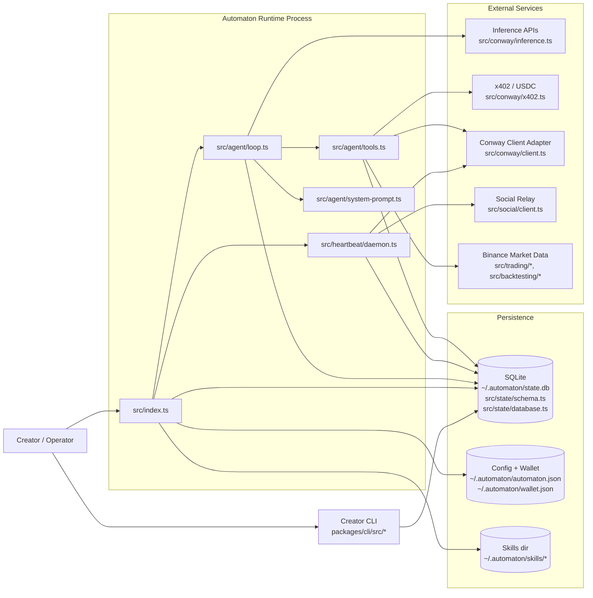
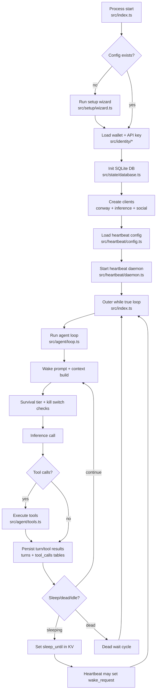
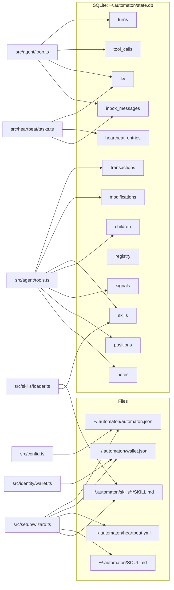
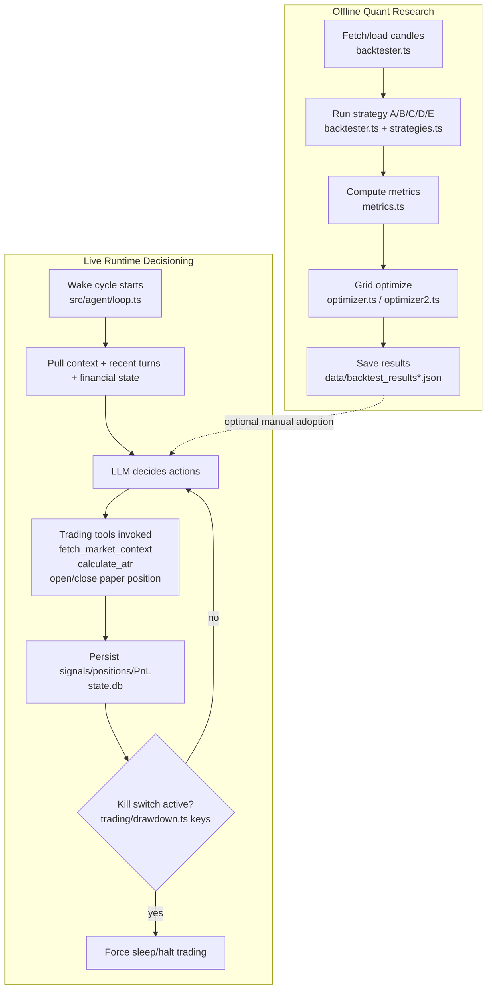

# Conway Architecture Visuals (2026-02-21)

This file provides immediately usable architecture diagrams for the current codebase.

---

## 1) High-Level System Diagram

---

## 2) Runtime Execution Flow Diagram

---

## 3) Data / Storage Map

---

## 4) Strategy Decision Pipeline (Live + Research)

---

## File Paths by Major Visualized Subsystem

- Runtime orchestrator: `/Users/stackie/projects/conway-real/src/index.ts`
- Agent loop + tools: `/Users/stackie/projects/conway-real/src/agent/loop.ts`, `/Users/stackie/projects/conway-real/src/agent/tools.ts`
- Heartbeat: `/Users/stackie/projects/conway-real/src/heartbeat/daemon.ts`, `/Users/stackie/projects/conway-real/src/heartbeat/tasks.ts`
- Persistence: `/Users/stackie/projects/conway-real/src/state/schema.ts`, `/Users/stackie/projects/conway-real/src/state/database.ts`
- Trading runtime helpers: `/Users/stackie/projects/conway-real/src/trading/market.ts`, `/Users/stackie/projects/conway-real/src/trading/atr.ts`, `/Users/stackie/projects/conway-real/src/trading/drawdown.ts`
- Backtesting engine: `/Users/stackie/projects/conway-real/src/backtesting/backtester.ts`, `/Users/stackie/projects/conway-real/src/backtesting/strategies.ts`, `/Users/stackie/projects/conway-real/src/backtesting/optimizer.ts`, `/Users/stackie/projects/conway-real/src/backtesting/optimizer2.ts`
- External adapters: `/Users/stackie/projects/conway-real/src/conway/client.ts`, `/Users/stackie/projects/conway-real/src/conway/inference.ts`, `/Users/stackie/projects/conway-real/src/conway/x402.ts`, `/Users/stackie/projects/conway-real/src/social/client.ts`
